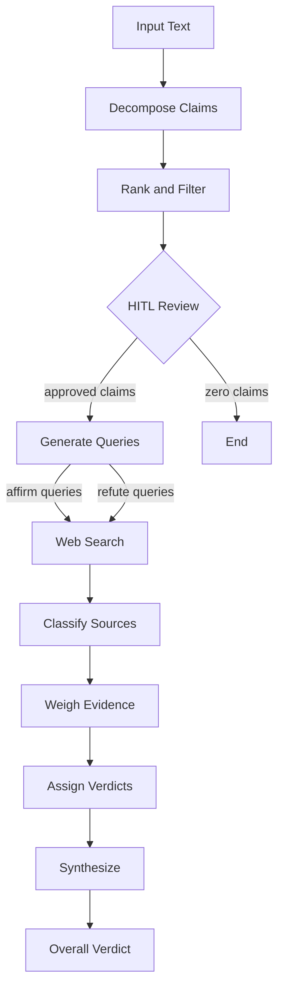

# Validity

An agentic claim-verification system that decomposes text into atomic claims, retrieves web evidence, tiers sources by credibility, and returns structured verdicts — with full agent reasoning visible in real time.

---

## Demo

> **Recording in progress.** See [`assets/RECORDING_INSTRUCTIONS.md`](assets/RECORDING_INSTRUCTIONS.md) for how to record the demo GIF.
>
> What it shows: paste text → watch ThoughtPanel stream live agent events → review claims in HITL modal → see per-claim verdicts with source tiers.


---

## Tech Stack

| Layer | Choice | Why |
|-------|--------|-----|
| Agent orchestration | LangGraph | Multi-node graph with HITL, streaming, conditional edges |
| LLM components | LangChain | Abstraction layer, prompt templates, output parsers |
| Web search | Serper (default) | Fast, cheap, structured results. Tavily + You.com as documented alts |
| LLM | GPT-4o / GPT-4o-mini | Dual-model: high-complexity nodes use 4o, structured tasks use mini |
| Backend | FastAPI | Async-native, WebSocket support, clean API |
| Frontend | Vite + React | Lightweight, fast builds |
| MCP | FastMCP | Wraps pipeline as Claude Desktop tools |
| Containerisation | Docker Compose | One command to run everything |

---

## What It Is

Online text is full of claims stated as fact. Verifying them manually means opening multiple browser tabs, assessing source credibility, and weighing contradictory results — a process nobody does systematically, and that degrades with the volume of claims.

Validity automates this. Paste a paragraph and the agent decomposes it into atomic claims, ranks them by verifiability and importance, pauses for you to approve the list (HITL), then fires adversarial search queries — both affirm and refute — for each claim. Sources are tiered by credibility (high/mid/low), evidence is weighed per claim, and a structured verdict is returned. Every step of the agent's reasoning is visible in real time in the ThoughtPanel.

---

## Architecture



**Node summary:**

| Node | Model | What it does |
|------|-------|--------------|
| Decompose | GPT-4o | Extracts atomic, verifiable claims — excludes opinions and vague assertions |
| Rank + Filter | GPT-4o-mini | Scores claims by verifiability × importance, selects top N |
| HITL | — | Pauses pipeline; user approves/removes/adds claims via modal |
| Generate Queries | GPT-4o-mini | Produces 2-3 affirm + 2-3 refute search queries per claim |
| Web Search | Serper API | Executes all queries in parallel, tags results with intent |
| Classify Sources | heuristic | Domains tiered: `.gov`/`.edu`/`arxiv` → HIGH; Reuters/BBC → MID; general `.com` → LOW |
| Weigh Evidence | GPT-4o | Classifies each source snippet as SUPPORTS / CONTRADICTS / IRRELEVANT |
| Assign Verdicts | GPT-4o-mini | Derives per-claim verdict (HIGH / MEDIUM / LOW / CONTRADICTED) |
| Synthesize | GPT-4o-mini | Aggregates per-claim verdicts into an overall assessment |

---

## Quick Start

### Docker (recommended)

```bash
git clone <repo-url> validity
cd validity

cp .env.example .env
# Edit .env — set LLM_API_KEY and SEARCH_API_KEY

docker compose up --build
```

Open [http://localhost:3000](http://localhost:3000). The backend health check is at [http://localhost:8000/api/health](http://localhost:8000/api/health).

### Local dev

**Prerequisites:** Python 3.11+, Node 20+

```bash
# Backend
pip install -r requirements.txt
cp .env.example .env  # fill in keys
uvicorn backend.main:app --reload --port 8000

# Frontend (separate terminal)
cd frontend
npm install
npm run dev
```

Open [http://localhost:5173](http://localhost:5173). Vite proxies `/api` to the backend automatically.

### Make shortcuts

```bash
make dev-backend    # uvicorn with hot-reload
make dev-frontend   # vite dev server
make docker         # docker compose up --build
make docker-down    # docker compose down
make test-mcp       # run MCP tool tests
make clean          # remove __pycache__ and .pyc files
```

---

## MCP Integration

Use the Validity pipeline directly from Claude Desktop.

### Setup

1. Find your `claude_desktop_config.json` (macOS: `~/Library/Application Support/Claude/claude_desktop_config.json`)
2. Add the validity server (update the path):

```json
{
  "mcpServers": {
    "validity": {
      "command": "python",
      "args": ["/path/to/validity/mcp/server.py"],
      "cwd": "/path/to/validity",
      "env": {
        "LLM_PROVIDER": "openai",
        "LLM_API_KEY": "sk-...",
        "LLM_MODEL_COMPLEX": "gpt-4o",
        "LLM_MODEL_STANDARD": "gpt-4o-mini",
        "SEARCH_PROVIDER": "serper",
        "SEARCH_API_KEY": "..."
      }
    }
  }
}
```

A reference config is at [`mcp/claude_desktop_config.json`](mcp/claude_desktop_config.json).

3. Restart Claude Desktop. The validity tools appear in the tool menu.

### Tools

| Tool | Description |
|------|-------------|
| `verify_text` | Full pipeline, HITL auto-approved. Pass text, get formatted verdict. |
| `verify_text_interactive` | Step 1: returns ranked claims with IDs. Step 2: verifies selected claims. |
| `get_run` | Retrieve a previous run's verdict by run_id (same process only). |

### Example

```
You: Use verify_text to check this:
"The Eiffel Tower is 330 metres tall. It was built in 1887. It is the tallest
structure in Paris."

Claude: [calls verify_text]

Overall Verdict: MEDIUM
Summary: Two of three claims are accurate; the construction date is slightly off.

Claims Verified: 3

1. "The Eiffel Tower is 330 metres tall"
   Verdict: HIGH (confidence: 0.92)
   Sources: britannica.com (MID), paris.fr (MID)

2. "It was built in 1887"
   Verdict: CONTRADICTED (confidence: 0.89)
   Sources: britannica.com (MID) — CONTRADICTS, history.com (LOW) — CONTRADICTS

3. "It is the tallest structure in Paris"
   Verdict: HIGH (confidence: 0.85)
   Sources: paris.fr (MID)
```

> **Note:** `get_run` only works for runs started in the same MCP server process. Runs from the web UI are stored separately in the FastAPI server's in-memory store.

---

## Design Decisions

### 1. HITL — a named agentic pattern, not a UX feature

Human-in-the-loop at the claim review step solves a real problem: LLMs decomposing a paragraph will extract 8-15 claims, many trivial ("The meeting was on Tuesday"). Verifying all of them wastes API calls, tokens, and user attention. HITL pauses the pipeline after ranking, shows the user a prioritised list, and lets them approve, remove, or add claims before committing search budget to the run. This is the standard pattern for agentic claim explosion — not a courtesy feature.

### 2. Adversarial search — affirm + refute, not just confirmation bias

For each claim, the pipeline generates two sets of search queries: affirm queries designed to find supporting evidence, and refute queries designed to find contradicting evidence. This is deliberate. It's easy to find agreement online for almost any claim. Actively trying to disprove a claim is what makes verification meaningful rather than just confirmation search dressed up as fact-checking.

### 3. Source tier classification — heuristic, honest about limitations

v1 classifies sources by domain heuristics: `.gov`, `.edu`, `arxiv.org`, `pubmed` → HIGH; Reuters, BBC, AP, `.org` (established) → MID; general `.com` → LOW. This is directionally correct for most sources and requires no API calls. But it has known gaps: a `.edu` professor's personal blog isn't a peer-reviewed paper; a `.com` investigative piece can be excellent. An ML-based credibility classifier (domain authority, author signals, citation count) is on the v2 roadmap.

### 4. Provider abstraction — dual-model pattern, configurable via `.env`

Every LLM call goes through `get_llm(complexity="high"|"standard")`. High-complexity nodes (decompose, weigh evidence) use GPT-4o; structured, lower-complexity nodes (rank, query gen, verdict, synthesis) use GPT-4o-mini. Switching to Anthropic is a `.env` change: `LLM_PROVIDER=anthropic` maps high→Claude Sonnet 4, standard→Claude Haiku 4.5. Search is similarly abstracted: Serper (default), Tavily, You.com, or mock for testing.

### 5. HITL implementation — asyncio.Event (Approach B)

The graph is compiled without a LangGraph `MemorySaver` checkpointer and invoked with `ainvoke()` in a single call. Rather than adding a MemorySaver and catching `GraphInterrupt` exceptions (which would require significant refactoring of the Phase 2 invocation pattern), the HITL node uses a per-run `asyncio.Event` stored on the `StreamingCallbackHandler`. The hitl node awaits the event; the WebSocket handler sets it when the client sends a `hitl_response` message. Since `ainvoke()` and the WebSocket handler both run in the same asyncio event loop, this is textbook asyncio coordination — no checkpointing required.

---

## Build Breakdown

| Phase | Approx. time | What was built |
|-------|-------------|---------------|
| Planning + spec | ~3h | Architecture decisions, LLM call map, HITL approach selection |
| Phase 1: Core pipeline | ~8h | FastAPI skeleton, LangGraph graph, all 8 nodes, Serper integration, sync endpoint |
| Phase 2: Streaming + frontend | ~6h | WebSocket endpoint, callback handler, React app, ThoughtPanel, VerdictPanel |
| Phase 3: HITL | ~3h | asyncio.Event HITL, ClaimModal, bidirectional WebSocket, resume flow |
| Phase 4: MCP + Docker + docs | ~3h | FastMCP server, Docker Compose, nginx proxy config, full README |
| **Total** | **~23h** | |

---

## V2 Roadmap

- **ML source credibility classifier** — domain authority, author signals, citation count beyond domain heuristics
- **Citation verification mode** — paste text with citations, verify claims against their own cited sources
- **Batch mode** — process multiple paragraphs/documents in queue
- **Browser extension** — highlight text on any page, right-click → verify with Validity
- **Full REST API** — documented OpenAPI endpoints for third-party integration
- **Claim history** — store past verifications, detect when previously-verified claims become outdated

---

## License

MIT
