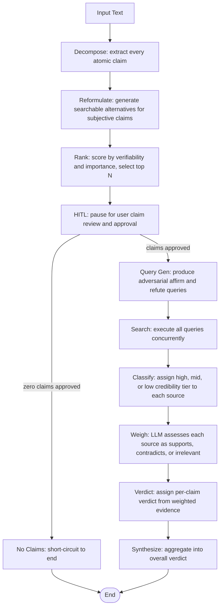

# Validity

Validity cuts through confirmation bias by checking every atomic claim in a block of text for evidence both supporting and contradicting it.

## Demo


## What it does

The internet is an echo chamber: whatever you look for, you will find. 

Validity extracts each atomic claim from the text you paste, then fires adversarial search queries designed to find proof for and against each one. The output is a structured verdict per claim, sources tiered by credibility (high, mid, or low), and full agent reasoning visible in real time as each pipeline node fires.

For a full technical deep-dive into architecture decisions, build phases, and iteration notes, see SPEC.md.

## Tech stack

| Layer | Choice |
|-------|--------|
| Orchestration | LangGraph |
| LLM framework | LangChain |
| Search APIs | Serper / Tavily / You.com (configurable) |
| LLM providers | OpenAI / Anthropic (configurable) |
| Backend | FastAPI |
| Frontend | Vite + React |
| Tool integration | FastMCP |
| Infrastructure | Docker Compose |

## Architecture



## Key engineering decisions

**HITL as a named agentic pattern.** Human-in-the-loop at the claim review step solves a real problem: an LLM decomposing a paragraph will extract 8 to 15 claims, many of them trivial. Verifying all of them wastes API calls, tokens, and attention. HITL pauses the pipeline after ranking, shows the user a prioritised list, and lets them approve, remove, or add claims before the search budget is committed.

**WebSocket streaming, push not polling.** The frontend opens a single WebSocket connection at run start and receives all events as they arrive. Every LangGraph node emits structured events via a custom callback handler, and FastAPI pushes them directly to the connected client. No polling, no SSE complexity, no client-side timers. The result is a live stream of agent reasoning that updates in real time with no round-trip overhead.

**asyncio.Event over LangGraph native interrupt.** The graph is compiled without a LangGraph MemorySaver checkpointer and invoked with `ainvoke()` in a single call. Using LangGraph's native `interrupt()` pattern would require adding a MemorySaver, catching `GraphInterrupt`, and re-invoking with `Command(resume=...)`, which would have required significant refactoring of the existing invocation model. Instead, the HITL node stores a per-run `asyncio.Event` on the callback handler, awaits it, and the WebSocket handler sets it when the client sends claim approval. Both run in the same asyncio event loop: standard asyncio coordination, no checkpointing required.

**Configurable providers via .env.** Every LLM call routes through `get_llm(complexity="high"|"standard")`. High-complexity nodes (decompose, weigh evidence) use the capable model; structured lower-complexity nodes (rank, query gen, verdict, synthesize) use the fast model. Switching from OpenAI to Anthropic is a single `.env` change: `LLM_PROVIDER=anthropic` maps high to Claude Sonnet 4 and standard to Claude Haiku 4.5. Search is abstracted the same way across Serper, Tavily, and You.com.

## How to run

### Docker (recommended)

```bash
git clone <repo-url> validity
cd validity
cp .env.example .env
# Edit .env: set LLM_API_KEY and SEARCH_API_KEY at minimum
docker compose up --build
```

Open http://localhost:3000. Backend health check: http://localhost:8000/api/health.

### Local dev

Prerequisites: Python 3.11+, Node 20+

```bash
# Backend
pip install -r requirements.txt
cp .env.example .env
uvicorn backend.main:app --reload --port 8000

# Frontend (separate terminal)
cd frontend
npm install
npm run dev
```

Open http://localhost:5173. Vite proxies `/api` to the backend automatically.

### Required .env fields

```bash
LLM_PROVIDER=openai                    # openai | anthropic
LLM_API_KEY=sk-...
LLM_MODEL_COMPLEX=gpt-4o              # Decompose and evidence weighing
LLM_MODEL_STANDARD=gpt-4o-mini        # Rank, query gen, verdict, synthesis
SEARCH_PROVIDER=serper                 # serper | tavily | you
SEARCH_API_KEY=...
MAX_CLAIMS=5
MAX_SOURCES_PER_CLAIM=5
LOG_LEVEL=info
```

## MCP integration

Use the Validity pipeline directly from Claude Desktop. Add the server to your `claude_desktop_config.json` (macOS: `~/Library/Application Support/Claude/claude_desktop_config.json`):

```json
{
  "mcpServers": {
    "validity": {
      "command": "python",
      "args": ["/path/to/validity/mcp/server.py"],
      "cwd": "/path/to/validity",
      "env": {
        "LLM_PROVIDER": "openai",
        "LLM_API_KEY": "sk-...",
        "LLM_MODEL_COMPLEX": "gpt-4o",
        "LLM_MODEL_STANDARD": "gpt-4o-mini",
        "SEARCH_PROVIDER": "serper",
        "SEARCH_API_KEY": "..."
      }
    }
  }
}
```

Restart Claude Desktop. Three tools will appear:

| Tool | Description |
|------|-------------|
| `verify_text` | Runs the full pipeline with HITL auto-approved and returns a formatted verdict for every claim. |
| `verify_text_interactive` | Two-step: step 1 returns ranked claims with IDs, step 2 verifies the specific claims you select. |
| `get_run` | Retrieves a completed run's verdict by run_id, for runs started in the same MCP server process. |

## Known limitations

- Subjective claim extraction is inconsistent: the decompose node extracts all statements including opinions, and the reformulate node attempts to make subjective ones more searchable, but quality varies significantly with input phrasing.
- Source tier classification uses domain heuristics plus an LLM fallback for unknown domains. It is directionally correct but not infallible: a `.edu` personal blog and a peer-reviewed journal receive the same tier; a quality `.com` investigative piece may rank low.
- The run store is in-memory and lost on restart. Runs from the web UI and the MCP server are not shared.
- Input is capped at 5000 characters.

## V2 roadmap

- ML source credibility classifier: domain authority, author signals, citation count beyond domain heuristics
- Citation verification mode: paste text with its own citations, verify claims against the cited sources
- Batch mode: process multiple paragraphs or documents in a queue
- Browser extension: highlight text on any page and verify with one click
- Full REST API: documented OpenAPI endpoints for third-party integration
- Claim history: store past verifications, detect when previously-verified claims become outdated
